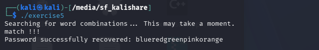

# Exercise 5

**Solver:** Chițimia Diana-Andreea  

## Task Description: 
The following shadow entry was generated by a password formed by an
arbitrary arrangement of the following words: red, green, blue, orange, pink.
Find the password.

## Shadow Entry
 tom:$6$9kfonWC7$gzqmM9xD7V3zzZDo.3Fb5mAdM0GbIR2DYTtjYpcGkXVWatTC0paXVvKTXLb1ZP0NG9cinGRZF7gPLdhJsHDM/:16471:0:99999:7:::

---

## Source Code
**File:** `exercise5.cpp`

```cpp
#include <iostream>
#include <list>
#include <cstring>
#include <crypt.h>

using namespace std;


string target_salt = "$6$9kfonWC7$";
string target_pw_hash = "$6$9kfonWC7$gzqmM9xD7V3zzZDo.3Fb5mAdM0GbIR2DYTtjYpcGkXVWatTC0pa/XVvKTXLb1ZP0NG9cinGRZF7gPLdhJsHDM/";

// Define a null string which is returned in case of failure to find the password
char null_str[] = {'\0'}; 

// The maximum length is 22 because the sum of all 5 words (red, green, blue, orange, pink) is 22 characters
#define MAX_LEN 22

list<char*> pwlist;


int check_password(char* pw, char* salt, char* hash) {
    char* res = crypt(pw, salt);
    
    for (int i = 0; i < strlen(hash); i++) {
        if (res[i] != hash[i]) return 0;
    }
    
    cout << "match !!!\n";
    return 1;
}

// Builds passwords from the given word set
// and verifies if they match the target
char* exhaustive_search(const char* words[], int num_words, char* salt, char* target) {
    char* current_password;
    char* new_password;
    int i, current_len;

    // Begin by adding each WORD as a potential starting password
    for (i = 0; i < num_words; i++) {
        new_password = new char[strlen(words[i]) + 1];
        strcpy(new_password, words[i]);
        pwlist.push_back(new_password);
    }

    while (true) {
        // Test if queue is not empty and return null if so
        if (pwlist.empty()) return null_str;

        // Get the current_password from queue
        current_password = pwlist.front();
        current_len = strlen(current_password);

        // Check if current password is the target password, if yes return it
        if (check_password(current_password, salt, target)) {
            return current_password;
        }

        // Else generate new passwords by appending each WORD from the array,
        // only if the current length is less than the maxlength
        if (current_len < MAX_LEN) {
            for (i = 0; i < num_words; i++) {
                // Allocate memory for the current password + the new word + the null terminator
                new_password = new char[current_len + strlen(words[i]) + 1];
                strcpy(new_password, current_password);
                strcat(new_password, words[i]); // Append the word instead of a single char
                pwlist.push_back(new_password);
            }
        }

        // Now remove the front element as it didn't match the password
        pwlist.pop_front();
        
        // FREE the memory
        delete[] current_password; 
    }
}

int main() {
    char* salt;
    char* target;
    char* password;

    // Define the word set from which the password will be built
    const char* words[] = {"red", "green", "blue", "orange", "pink"};
    int num_words = 5;

    // Convert the salt from string to char*
    salt = new char[target_salt.length() + 1];
    copy(target_salt.begin(), target_salt.end(), salt);
    salt[target_salt.length()] = '\0'; // Adăugăm terminatorul de șir

    // Convert the hash from string to char*
    target = new char[target_pw_hash.length() + 1];
    copy(target_pw_hash.begin(), target_pw_hash.end(), target);
    target[target_pw_hash.length()] = '\0'; // Adăugăm terminatorul de șir

    cout << "Searching for word combinations... This may take a moment.\n";
    password = exhaustive_search(words, num_words, salt, target);

    if (strlen(password) != 0) {
        cout << "Password successfully recovered: " << password << "\n";
    } else {
        cout << "Failure to find password, try distinct character set or size \n";
    }

   
    delete[] salt;
    delete[] target;

    return 0;
}
```
---


**Answer:** `blueredgreenpinkorange`
